# 2024 硬件部招新面前题

## 简介

这是先锋硬件部 2024 年的招新试题。  
PS：做前提示：不用担心什么都看不懂，做不来，学习本身才是最重要的。

## 目录

- 主板及其接口
- 操作系统的安装与维护
- 台式机硬件配置及组装
- 其他可能遇见的问题
- 超难附加题

## 寄语

## 题目简要说明

我们从今年，首次采用了题目难度分级标注的模式，以`星级`​ 数标识，一般情况下，1 星最简单，5 星最复杂。我们在标注难度时，更加看重的是**复杂程度**，而不是题目的难度（但其实，有时候复杂就会导致难）。

难度指标（**仅作参考！** ）：

- 1 星：可以通过搜索引擎 / AI 提问等方式，直接得到类似的答案，且解决步骤较为简单。
- 2 星：有较长的教程，跟着教程来，就能做出来。
- 3 星：要经过自己的学习和研究才能做出来的
- 4 星：必须要有相关知识的储备或者稍微深入的学习才能解决的，或者可能有多个协作的知识点

- 5 星：在 4 星基础上，有一定的开放性

（另外没错这是直接从网络部复制的，手动狗头）

## 题目开始

## 一.主板及其接口

在硬件部的日常工作中，会遇到各种各样的电脑，包括笔记本和台式机等，那么就需要你对基础的接口有一定的认识，并且可以从接口的物理特点以及走线等推断接口的用处。

### 1.台式机主板的侧面接口

**1.1.** 这是某个台式机主板的 IO 接口面板，请指出图中你认识的接口的名字，及他们的用处。`⭐️`
​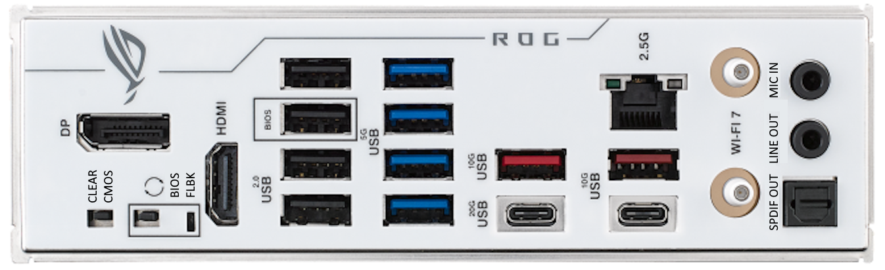​

**1.2.** 上图中“长方形”的接口为什么接口？在这个接口的家族中，还有什么其他样式的接口？（简述该接口的类型，共可细分为至少七种，并指出这些类型的接口在不同的协议下的区别）`⭐️⭐️⭐️`

**1.3.** 兄弟想玩《黑神话：悟空》，但是电脑的硬盘空间不够了，于是兄弟翻出了多年前火车站买的特价 16T 高速硬盘盒，并随便找了根线，请回答下面问题

**(1).** 下图中的标识可能出现在该接口的附近及其线缆上，请指出他们的区别？理论支持的最大速率是多少？有什么特殊功能？`⭐️⭐️⭐️⭐️`

**(2).** 左图中硬盘盒出现的接口为什么接口？用右图的数据线连接，硬盘盒能不能正常运转？如果能用，又会与原装数据线有什么区别？`⭐️⭐️⭐️⭐️`
‍
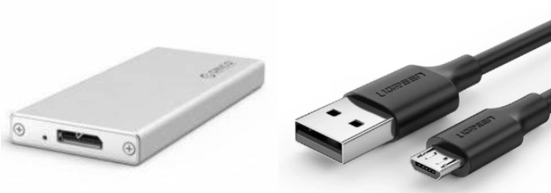

**(3).** 最终兄弟发现硬盘盒是假的，请你告诉兄弟如何鉴别真假硬盘盒`⭐️⭐️⭐️`

### 2.笔记本主板

**2.1.** 以下两张图片是两款笔记本的拆机图，请指出其中你认识的部件`⭐️⭐️⭐️`

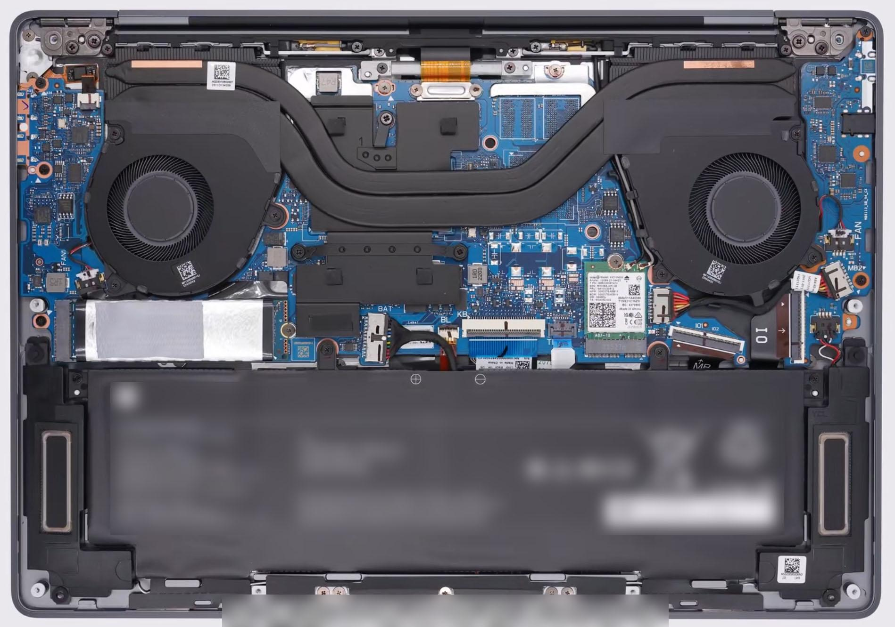

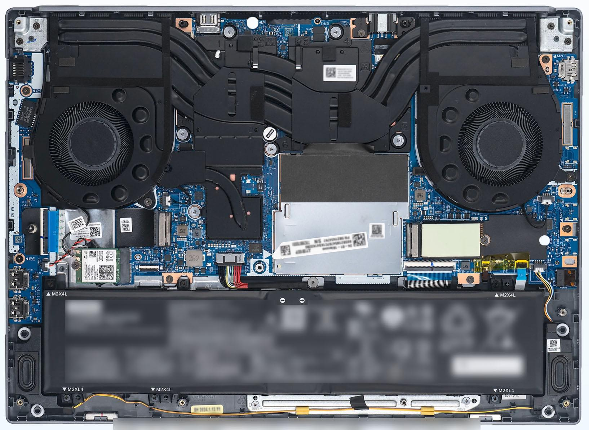

**2.2.** 请简述清灰换硅脂，换固态硬盘，内存条的操作方法，并指出哪些步骤值得注意 `⭐️⭐️⭐️`

### 3.台式机主板

**3.1.** 这是某个台式机主板的图片，请试着指出其中你认识的接口，及能连接什么设备`⭐️⭐️⭐️⭐️⭐️`
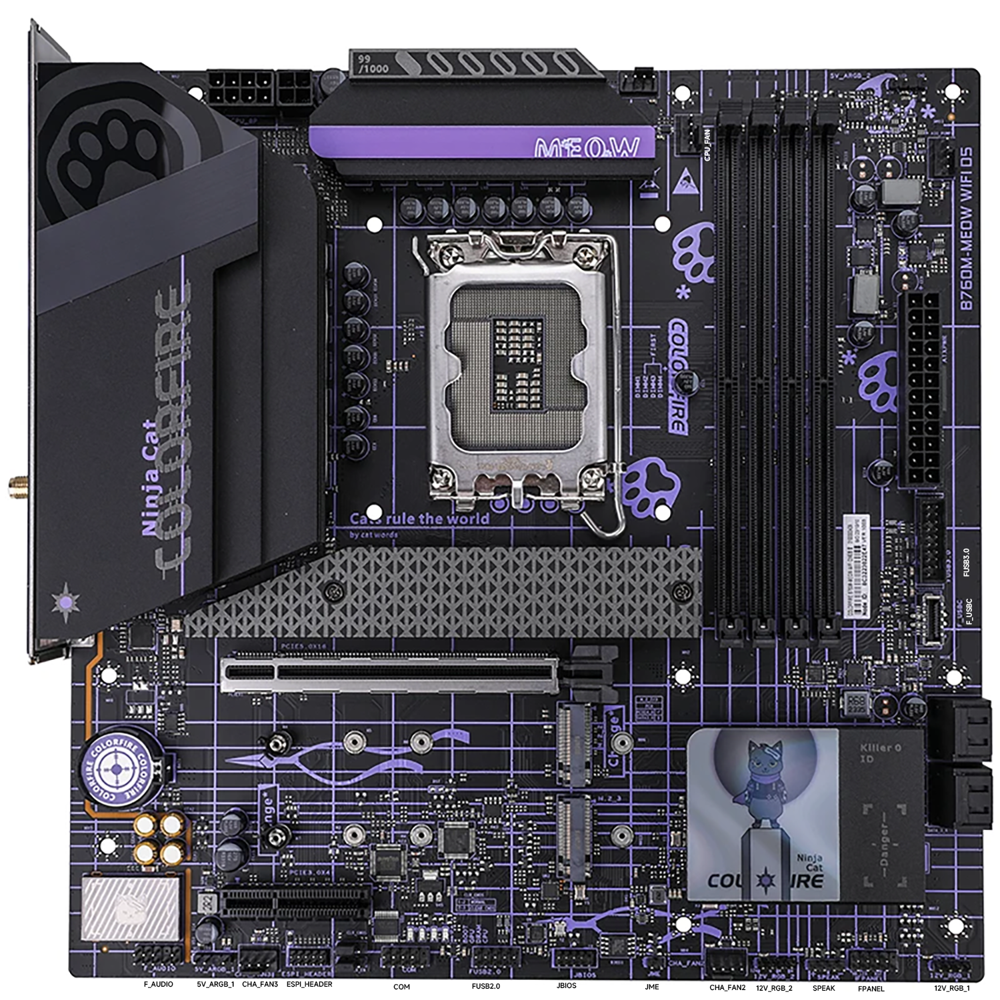

**3.2.** 在上图主板中，一共有几条内存条插槽？当我们插内存条的时候，应注意哪些规则？`⭐️`为什么？`⭐️⭐️⭐️`

## 二.操作系统的安装与维护

硬件部工作中，对于系统的安装与维护也是重要的内容，经常性的重装系统也让“重装解决 99%的问题”从玩笑话变成真理(bushi

### 1.操作系统的安装

**1.1.** 你认识“PE 系统”吗，请简述它的作用。`⭐️`

**1.2.** 请尝试制作一个 PE 系统启动 U 盘，并在借助或不借助 PE 系统的条件下部署和激活 Windows 11 操作系统。`⭐️⭐️`

**1.3.** 请在借助或不借助 PE 系统的条件下部署任一 Linux 发行版`⭐️⭐️`~`⭐️⭐️⭐️⭐️`

### 2.操作系统的维护

**2.1.** 请在借助或不借助 PE 系统的条件下：

- 进行空磁盘分区`⭐️⭐️`
- 有数据磁盘分区`⭐️⭐️⭐️`
- 磁盘对拷`⭐️⭐️⭐️`

**2.2.** 请尝试在全新的 Windows 11 系统中安装以下内容：

- 微信等常用软件`⭐️`
- Microsoft Office 等常用专业软件及其激活(如有必要)`⭐️⭐️`
- Steam 等非国区但常用软件`⭐️⭐️`
- 显卡、网卡等硬件驱动`⭐️⭐️`
- Adobe 系列、Solidworks 等硬核专业软件`⭐️⭐️⭐️`
- 无官网的软件`⭐️⭐️⭐️`

**2.3.** 万恶的 P2P 下载器

你知道什么是"P2P 下载器"吗？它有什么坏处？`⭐️`

在安装软件时该如何辨别？`⭐️⭐️`

应该怎样避开它？`⭐️⭐️⭐️`

**2.4.** BIOS 是什么？它都能用来做些什么？我们该如何更新它？(提示：可参考之前某道题中的内容)

### 3.硬件的测试与维护

**3.1.** 你知道哪些硬件测试程序？`⭐️`

他们都能用来做什么？`⭐️⭐️⭐️⭐️`

**3.2.** “烤机”指什么？`⭐️`

“双烤”中的“双”是什么？`⭐️`

应该使用什么工具？`⭐️⭐️`

**3.3.** 大家常说的硬盘“0E”是什么意思？`⭐️`

应该用什么工具测试？`⭐️⭐️`

## 三、台式机硬件配置及组装

### 3.1.警惕台式机整机骗局`⭐️⭐️⭐️`

兄弟终于开学了！开学前兄弟要买台新电脑了，兄弟想买个超 NB 的 i9 电脑，但是怕拿不准于是给你发了几张截图，请帮兄弟指明白这些电脑的坑都在什么地方？

​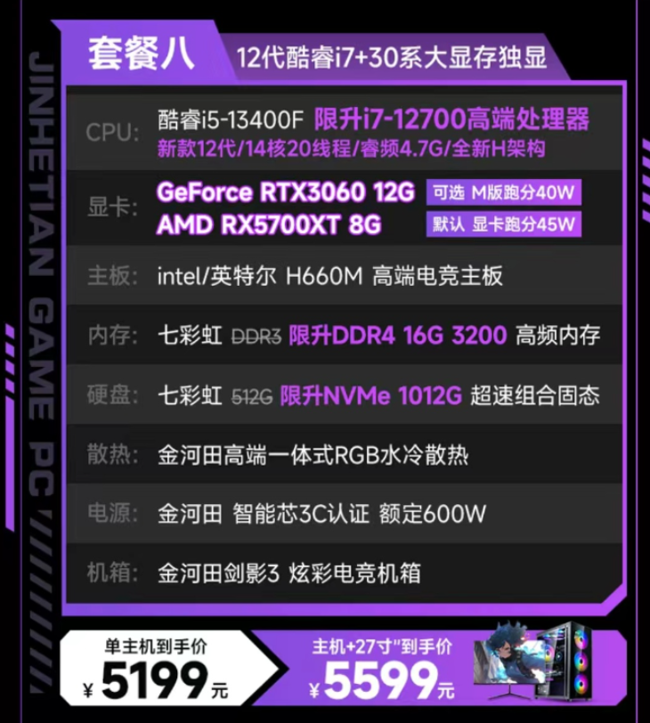

​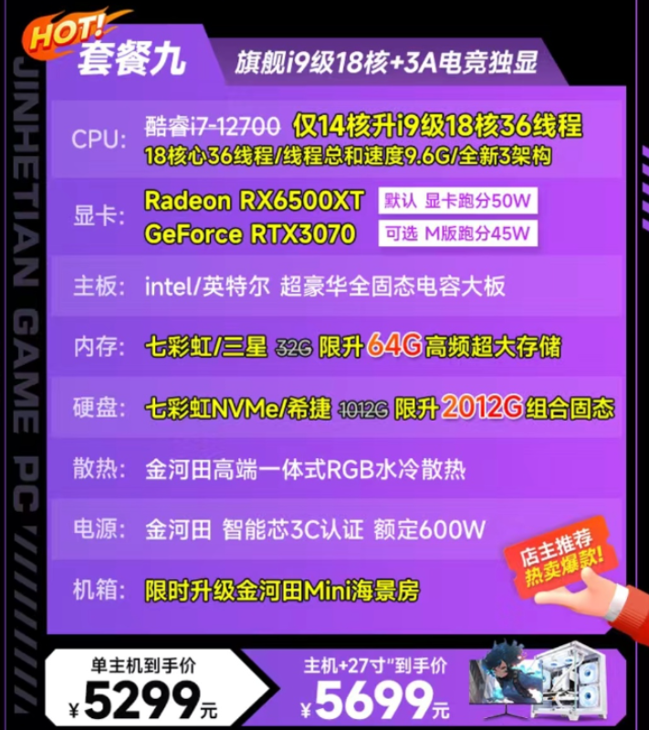​

​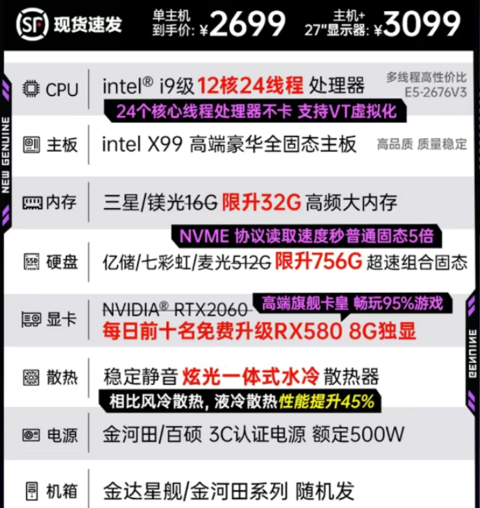​

​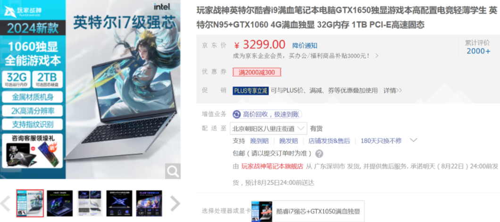​

### 3.2.网购电脑开箱检查`⭐️⭐️`

兄弟很听劝，并没有买上述的那些电脑，反手买了天选 5pro 锐龙版 2023，但也因为上面的那些骗局，第一次这么大金额的网购也使兄弟有些焦虑，怕再被坑到，你能教教兄弟如何正确查验开箱网购到的笔记本电脑吗？

### 3.3.组装整机

兄弟想玩《黑神话：悟空》，但手里只有 1000 块。扣去买游戏花的 268 块钱，你便帮兄弟用剩下的钱配一套能玩《黑神话：悟空》的机器罢。兄弟家有电视当显示器，但是还需要买外设，机器的寿命不做要求，只要能帮助兄弟玩个百八小时就行，剩下的钱自己买饮料喝。`⭐️⭐️⭐️⭐️⭐️`

- 要求：能正常启动进入系统；至少能以 1080p 30 帧运行《黑神话：悟空》；鼓励尽量省预算、提高性能或者增加硬件稳定性。

- 提示：以下是《黑神话：悟空》官方最低配置
  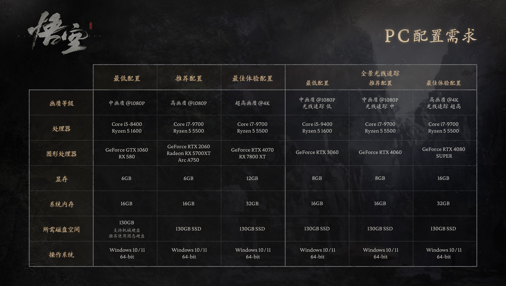

- 兄弟看配置需求的时候注意到推荐使用固态硬盘，兄弟对此很好奇，想知道固态硬盘到底比机械硬盘快在哪里？`⭐️⭐️⭐️`

## 四.其他可能遇见的问题

### 1.`⭐️⭐️⭐️⭐️`

兄弟历经九九八十一难，终于安装好了《黑神话：悟空》，他迫不及待得点击开始游戏，弹出的窗口却让他心头一凉：

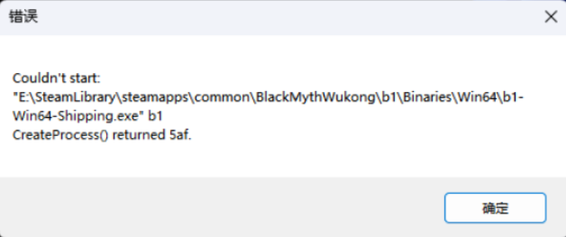

这是怎么回事呢？兄弟赶紧百度了错误信息，在 C\*DN 网站上他了解到这是由于内存不足而导致的启动失败，这就好办了！只见他打开任务管理器，想找找是什么妖魔鬼怪抢走了他的内存：

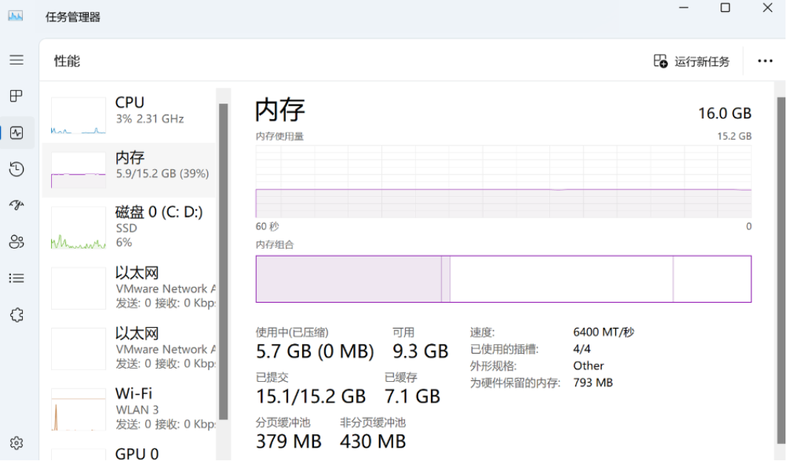

他懵了，这不还剩很多吗！？到底是哪里内存满了呢？

聪明的大学生啊，你能帮他度过这一难关吗？（如果可能的话，可以尝试复现类似的情况）

### 2.`⭐️⭐️⭐️`~`⭐️⭐️⭐️⭐️`

可恶的黑吗喽！！！为什么我家是千兆宽带但是下载速率只有 80MB/s，(兄弟愤怒得挥着手中的金箍棒砸向了电脑，然后将它扔进了垃圾桶里.gif)

作为知识渊博的大学生，请你帮兄弟解决这个问题吧

问：GB，GiB，MB/s，Mbps，Mhz，MT/s 的区别。

### 3.请简述你知道的文件系统，并说出他们的特点和区别`⭐️⭐️⭐️⭐️`

## 五、超难附加题

### 1.`⭐️⭐️⭐️⭐️⭐️`

这里有一台 Xiaomi 14，它的信息如图：

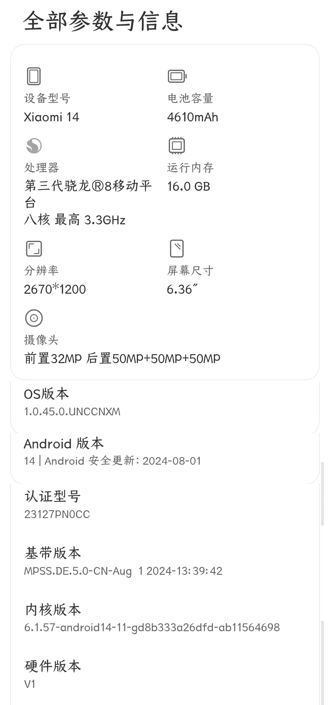

还有一台 Redmi K60，它的信息如图：

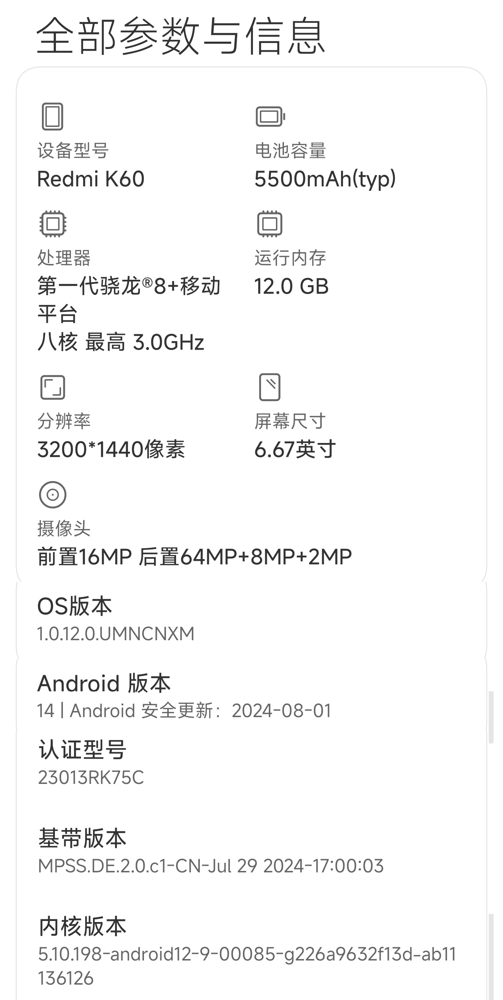

假如你是一名极客玩家，要对上述两部手机进行 root，请简述：

- 你觉得还需要什么信息才能开始 root？
- 你应该如何 root 这部手机？
- 在进行 root 时应该注意些什么？
- 可能出现哪些情况？应该如何修正/避免？

### 2.`⭐️⭐️⭐️⭐️⭐️`

学习了解 cpu，gpu，手机 soc 厂商，型号及其类似迭代规律，并发表你个人对他们的看法。

### 3.`⭐️⭐️⭐️⭐️⭐️`

假如你需要为一台设计用于大规模数据处理的工作站配置 NVMe SSD 存储系统，要求兼顾速度和可靠性。请回答以下问题：

1\. 在主板选择上，如何确保主板能够支持多块 NVMe SSD 的高速读写？请说明相关的技术要求和主板特性（如 M.2 插槽数量、PCIe 通道分配等）。

2\. 如果你计划使用四块 NVMe SSD 进行 RAID 0 配置以最大化读写速度，解释这样做的优缺点，并提供可能出现的数据安全风险管理方案。

3\. 系统安装完成后，如何优化操作系统（例如 Windows 或 Linux）以充分利用 NVMe SSD 的性能？请列举具体的优化措施（如驱动更新、BIOS 设置、系统文件分配等）。

限制条件：

\- 主板选择仅限于支持四个及以上 M.2 插槽的型号，并要求解释 PCIe 4.0 或更高版本对于 NVMe SSD 性能的影响。

\- RAID 配置仅限于 RAID 0，不能讨论 RAID 1 或其他 RAID 级别，并要求解释在这种配置下如何应对单块 SSD 故障。

\- 操作系统优化要求提供至少三项具体的设置或调整，包括但不限于 BIOS 的修改、驱动安装、文件系统优化。

### 4.`⭐️⭐️⭐️⭐️⭐️`

假设你正在为一台企业服务器配置 RAID 5 阵列，服务器内包含五块容量为 2TB 的 SATA 硬盘。现有如下任务：

1\. 请计算 RAID 5 阵列的总可用存储容量，并解释 RAID 5 的工作原理，特别是它如何通过奇偶校验提供容错能力。

2\. 在一个硬盘发生故障后，解释详细的故障处理流程，包括如何确定故障硬盘以及更换硬盘的具体步骤。

3\. 假设有两块硬盘同时出现故障，在不考虑备份的情况下，说明该情况下的数据恢复难度及可能的解决方案。

限制条件：

\- 回答时请假设 RAID 控制器支持在线热插拔，且使用的是标准的 SATA 硬盘接口。

\- 数据恢复部分要求详细说明可能使用的软件工具（如 TestDisk、R-Studio 等）和恢复的过程，包括磁盘镜像、RAID 结构重建等步骤。

\- 请不要回答 RAID 6 或其他 RAID 级别的内容，聚焦在 RAID 5 的特点和故障处理。

### 5.`⭐️⭐️⭐️⭐️⭐️`

小 C 最近为自己组装了一台高性能电脑，具体配置如下：

| 硬件组件   | 具体型号                     |
| ---------- | ---------------------------- |
| **主板**   | ASUS ROG Strix Z390-E        |
| **CPU**    | Intel Core i7-9700K (ES3 版) |
| **显卡**   | NVIDIA GeForce RTX 2080 Ti   |
| **内存**   | G.Skill 16GB DDR4 3200MHz    |
| **硬盘**   | Samsung 970 EVO 1TB NVMe SSD |
| **电源**   | Corsair RM850x 850W 金牌电源 |
| **散热器** | Noctua NH-D15                |

小 C 对这台电脑的性能非常期待，然而在实际使用中，他遇到了一系列棘手的问题。具体表现为：电脑在运行时出现随机重启、蓝屏死机，并且系统经常不稳定。小 C 尝试排查问题，先后更换了显卡、内存，重新安装了操作系统，但问题仍然没有得到解决。经过排查，他怀疑问题可能出在 CPU 上。小 C 使用的是 Intel Core i7-9700K 的工程样品（ES3 版），这种处理器在特定条件下可能会表现出不稳定性。

现在，小 C 决定进一步深入分析这个问题，并希望通过技术手段找到解决方案。

#### 小问 1：查阅资料并选择最有可能的解决方案

小 C 已经排除了显卡和内存问题，决定进一步查阅资料，找到导致系统不稳定的最有可能原因。以下哪些因素最有可能导致小 C 的系统不稳定？请从以下选项中选择一个最有可能的原因：

A. 显卡驱动不兼容 B. 主板 BIOS 版本过低 C. 内存频率过高 D. 电源供电不足 E. NVMe SSD 接口问题

#### 小问 2：填空题

小 C 决定进一步调整 BIOS 设置，希望通过调整 CPU 相关设置来提高系统稳定性。请填空回答以下问题：

在 BIOS 中，调整与 CPU 相关的设置时，\_\_选项的调整可能会改善 CPU 的稳定性。建议将电压设置为\_\_（具体值），这样可以确保系统在高负载下运行时更稳定。

#### 小问 3：简答题

在进一步分析后，小 C 怀疑问题可能与主板与 ES3 版 CPU 的兼容性有关。请结合主板 BIOS 版本更新、电源管理、系统优化、散热等方面进行详细分析，并提出一个具体的技术方案来解决这个问题。要求方案涵盖从硬件调试到系统设置的各个步骤，并充分考虑到工程样品处理器的特殊性。
