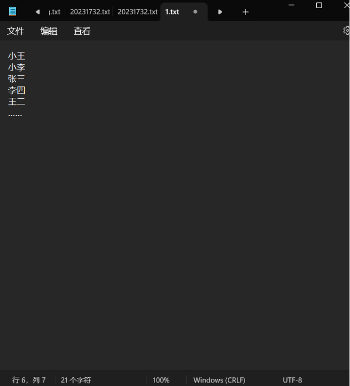

# Linux 与 shell

## 本节目录

- [Linux 与 shell](#linux-与-shell)
  - [本节目录](#本节目录)
    - [背景](#背景)
    - [题目一 `⭐️⭐️`](#题目一-️️)
    - [题目二 `⭐️⭐️⭐️`](#题目二-️️️)
    - [题目三 `⭐️⭐️⭐️⭐️⭐️`](#题目三-️️️️️)
    - [题目四 `⭐️⭐️⭐️⭐️⭐️`](#题目四-️️️️️)

### 背景

Linux 是一种自由和开放源代码的操作系统，它基于 Unix，并具有强大的功能和灵活性。在 Linux 环境中，你可以使用各种命令行工具和 shell 脚本来自动化任务、管理文件和目录。

在硬件开发、驱动开发、机器人等领域，linux 几乎是绕不开的；在国产硬件、国产操作系统等基础领域，linux 也几乎是绕不开的，甚至华为的鸿蒙系统，最开始也是基于 linux 的。

在本部分，主要要求学习掌握 linux 的一些内容。但其实，最好的老师是熟练，所以，本部分题目不多。

### 题目一 `⭐️⭐️`

1. 使用任意方式，得到 Linux **终端环境**。
2. 在你的 Linux 里，准备一些第三方工具。你需要先**自己**假设你需要干什么，然后安装对应的工具，并说明理由。（例如，想要搞硬件/嵌入式，就可能需要 gdb）

最后，你要将你的答案，进行保存。到面试时，进行展示。

**加分项：** 将你的产出，推送到在 git 题中，创建的仓库的 dev 或主分支中。

### 题目二 `⭐️⭐️⭐️`

1. `⭐️⭐️` 自行简要学习 shell 脚本语法。
2. `⭐️⭐️⭐️` 编写一个 shell 脚本，实现以下功能：
   - 读取一个文件，文件内容为数字，每行一个数字。
   - 计算并输出这些数字的总和和平均值。
   - 将数字的总和和平均值，输出到一个 json 文件中。
3. `⭐️⭐️⭐️⭐️` 编写一个 shell 脚本，实现以下功能：
   - 编写 shell 脚本，在电脑开机时播放 `原神启动！`。

最后，你要将你的答案，进行保存。到面试时，现场运行并进行展示。

**加分项：** 将你的产出，推送到在 git 题中，创建的仓库的 dev 或主分支中。

### 题目三 `⭐️⭐️⭐️⭐️⭐️`

`⭐️⭐️⭐️⭐️⭐️` 菜鸟喵在同行的压力下，他放弃了开发，转而去当起了体育老师。正好遇上了运动会，有 10000 名学生报名（学生不重名），结果实际上只来了 9990 人，现在你有两份名单，一份是当时报名的学生名单（txt 文件），一份是实际报道的名单，格式均为如下图所示（一行一个名字）。校长因为人没有全齐大发雷霆，这可怎么办呢，好在菜鸟喵是程序员出身的，现在你需要利用你学过的 shell 脚本知识来迅速查出那几个没来的人……经过了好几天激烈的比赛，总算诞生了 1000 名获奖选手，但是却只有他们的名字，而没有照片，为了防止有人冒领，现在你有当时参赛的 10000 名选手的照片，命名格式为“编号+名字.jpg”，还有一个 name.txt 文件，包含获奖选手的姓名，格式同名单，你要利用所学的 shell 知识在所有照片中找到获奖选手的名单，放到一个名为“winners_pic”的文件夹里。

你的任务是：

1. 完成第一个 shell 脚本，命名为 `data_gen.sh`，作用是：
   - 生成两个文件，一个名为 `name.txt`，包含 10000 个不重复的名字，每个名字占一行。
   - 生成另一个文件，名为 `names_attend.txt`，包含 9990 个名字，每个名字占一行。这些名字是从 `name.txt` 中随机选取的。
2. 完成第二个 shell 脚本，命名为 `find_winners.sh`，作用是：
   - 读取 `name.txt` 文件，获取获奖选手的名字。
   - 在所有照片中找到这些获奖选手的照片，并将它们复制到名为 `winners_pic` 的文件夹中。

最后，你要将你的答案，进行保存。到面试时，现场运行并进行展示。

**加分项：** 将你的产出，推送到在 git 题中，创建的仓库的 dev 或主分支中。

### 题目四 `⭐️⭐️⭐️⭐️⭐️`

`⭐️⭐️⭐️⭐️⭐️` 小 G 同学的服务运行在 Ubuntu 系统中，并且登录程序会自动记录每一个登录请求的信息在 log.log 文件下，请你帮他写一个 shell 脚本，定时自动备份（若相较于上次备份，该文件内容没有变化，则不进行本次备份）

最后，你要将你的答案，进行保存。到面试时，现场运行并进行展示。

**加分项：** 将你的产出，推送到在 git 题中，创建的仓库的 dev 或主分支中。
